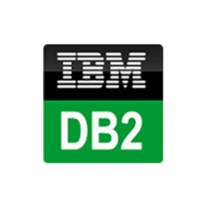

# DB2 Tips & Tricks

Some Tips and Tricks about DB2.

    

## Useful scripts

### Data lifecycle

* Column search
* Create table from DB2 structure

## Useful links

...

## Build with

* [Git](https://git-scm.com) - Open source distributed version control system

## Getting started with ...

...

## Contributing

If you would like to contribute, read the CONTRIBUTING.md file to learn how to do so.
